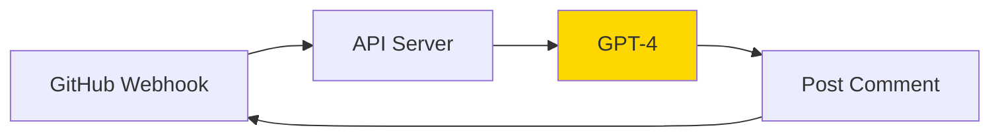
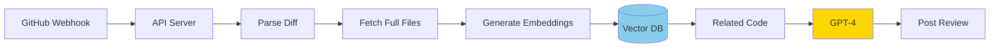
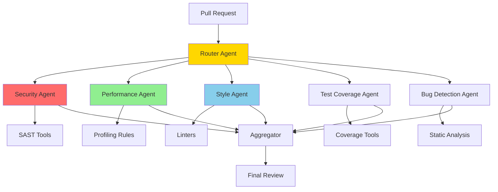
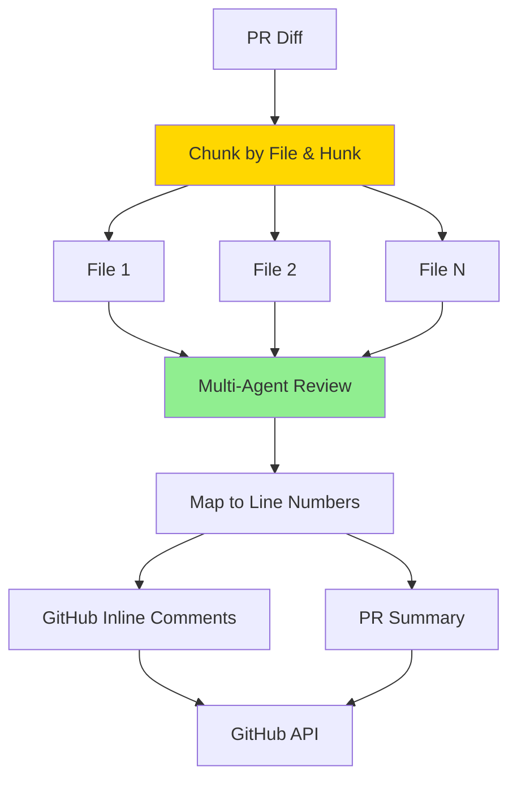
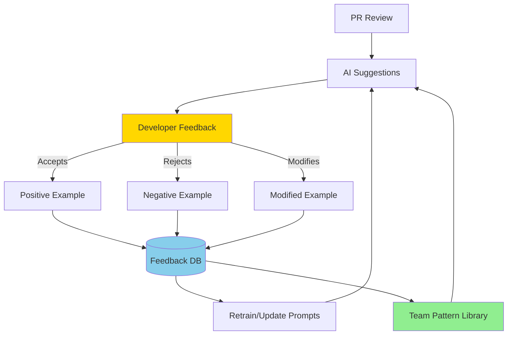
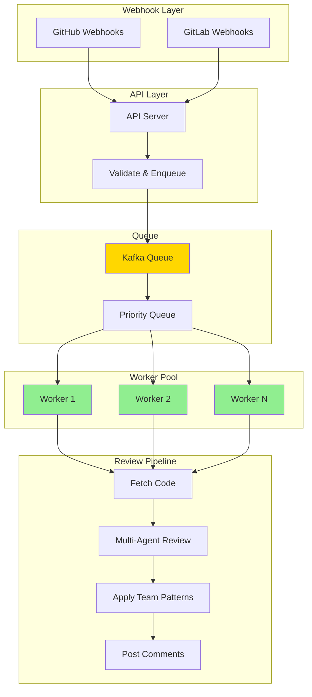
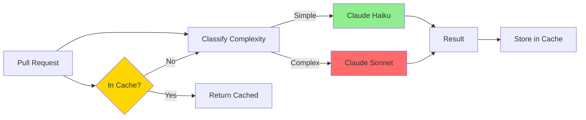
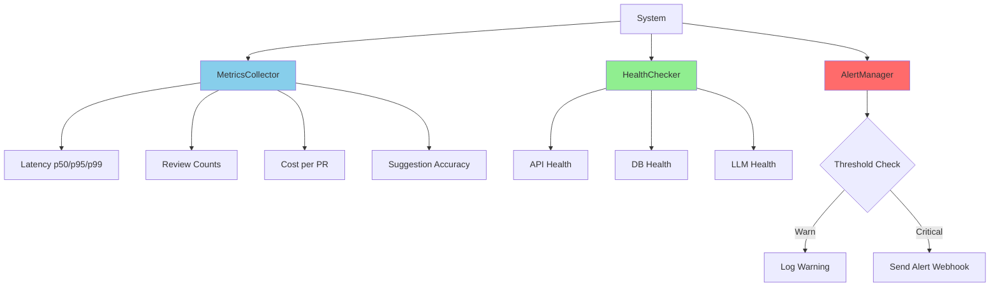
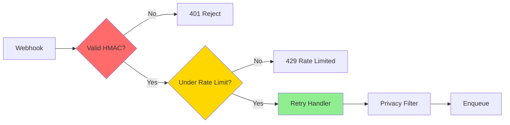
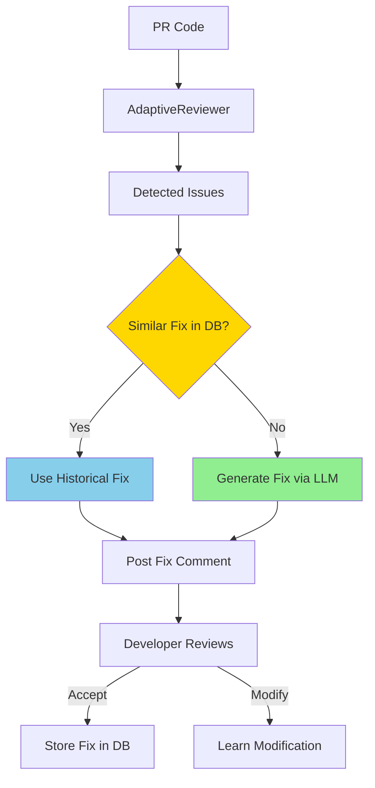

# AI-Powered Code Review System

A production-grade system that automatically reviews pull requests, detects bugs, security issues, and performance problems while learning team-specific patterns. Built iteratively across 10 architecture stages.

**Scale**: 500+ PRs/day, 50 repos, 200 developers, <$2/PR, <5min latency.

---

## Project Structure

```
src/
├── main.py                    # Iteration 1 - Single LLM review
├── architecture.py             # Iteration 2 - RAG + vector DB context
├── multi_agent.py              # Iteration 3 - 5 specialized agents
├── inline_review.py            # Iteration 4 - Inline line-level comments
├── learning.py                 # Iteration 5 - Team feedback loop
├── async_queue.py              # Iteration 6 - Priority queue + worker pool
├── cost_optimization.py        # Iteration 7 - Caching + model routing
├── monitoring.py               # Iteration 8 - Metrics + alerting
├── production_hardening.py     # Iteration 9 - HMAC, rate limit, retry
└── auto_fix.py                 # Iteration 10 - Auto-fix generation
```

---

## Iterations

### Iteration 1: Bare Minimum (`main.py`)



**What it does**: Single LLM (Claude) reviews the raw PR diff and posts a generic comment on the PR.

**What improved**: Fast to implement, basic review works.
**Problems**: No codebase context, hallucinations, expensive ($5-10/PR), no specialized checks.
**Tradeoff**: Generic feedback — developers will ignore it.

---

### Iteration 2: RAG Context (`architecture.py`)



**What it does**: Indexes the repository into ChromaDB using `sentence-transformers`. The LLM sees full file contents + similar code patterns from the codebase.

**What improved**: Fewer hallucinations, consistency checks against existing code.
**Problems**: Prompts are 5K+ tokens, slow (30s+), expensive.
**Tradeoff**: 3x token cost for 40% accuracy improvement.

---

### Iteration 3: Multi-Agent (`multi_agent.py`)



**What it does**: 5 specialized agents run in parallel: Security, Performance, Style, Bugs, Tests. Security agent runs Bandit SAST tool + LLM.

**What improved**: Each agent catches issues others miss, structured JSON output.
**Problems**: 5x LLM calls, no inline comments, no learning.
**Tradeoff**: 5 agents cost more but catch 40% more vulnerabilities.

---

### Iteration 4: Inline Comments (`inline_review.py`)



**What it does**: Parses the diff into file+hunk chunks and maps each finding to a specific line number. Posts inline GitHub review comments.

**What improved**: Developers see feedback on the exact line, better UX.
**Problems**: Line mapping errors, comment spam, still no learning.
**Tradeoff**: Only post critical/high inline; group medium/low in summary.

---

### Iteration 5: Learning (`learning.py`)



**What it does**: Records AI suggestions in a DB and tracks developer feedback (accepted/rejected/modified). Stores accepted patterns in a vector DB with confidence scoring. Filters out suggestions the team typically rejects.

**What improved**: Reduces false positives by 60%, team-specific, builds knowledge base.
**Problems**: Cold start (needs 2 weeks of data), still expensive.
**Tradeoff**: 3-phase rollout: learn -> filter -> fully adaptive.

---

### Iteration 6: Async Queue (`async_queue.py`)



**What it does**: Priority queue with 4 levels (CRITICAL, HIGH, NORMAL, LOW). Worker pool distributes load proportionally. Status endpoint for tracking.

**What improved**: Scales to 2880 PRs/day (17% utilization at 500/day), non-blocking.
**Problems**: No incremental review, limited monitoring.
**Tradeoff**: 10 workers ($24/day) to handle peak 1.74 PRs/min.

---

### Iteration 7: Cost Optimization (`cost_optimization.py`)



**What it does**: Semantic cache (SHA256 hash, 30min TTL). Model router classifies diff complexity and uses cheaper models for style/tests. Incremental diff tracker.

**What improved**: $1.55 → $0.80 per PR (48% savings).
**Problems**: Cache invalidation on new feedback.
**Tradeoff**: Cache hits skip LLM entirely; tune TTL per repo.

---

### Iteration 8: Monitoring (`monitoring.py`)



**What it does**: MetricsCollector tracks latencies (p50/p95/p99), errors, costs, and suggestion acceptance rate. HealthChecker runs component checks. AlertManager sends webhook alerts on threshold breaches.

**What improved**: Full observability, early warning on latency/cost spikes.
**Problems**: In-memory storage (Prometheus needed for prod).
**Tradeoff**: Alert thresholds tuned per team — too sensitive = noise.

---

### Iteration 9: Production Hardening (`production_hardening.py`)



**What it does**: HMAC-SHA256 webhook validation, IP-based rate limiting (200 req/min), exponential backoff retry (3 attempts), data privacy filter for secrets in logs.

**What improved**: Protection against forged webhooks, abuse, secret leaks.
**Problems**: Additional request overhead from validation.
**Tradeoff**: Rate limiting protects infra but may block legitimate bursts.

---

### Iteration 10: Auto-Fix (`auto_fix.py`)



**What it does**: FixGenerator asks Claude Sonnet to produce corrected code. SuggestionApplier stores accepted fixes and retrieves similar ones via vector search. CodeGenerationSkill generates tests, docstrings, and refactors.

**What improved**: Not just detection — developers get ready-to-apply fixes.
**Problems**: Generated fixes need human review (advisory only).
**Tradeoff**: Auto-fix works for simple patterns; complex refactors still need senior devs.

---

## Iterations 7-10: Summary

Iterations 7-10 focus on production readiness: cost optimization, monitoring, hardening, and auto-fix capabilities.

### Iteration 7: Cost Optimization
- **Model routing**: Use cheaper models (Haiku) for style/test reviews, Sonnet for complex security/performance
- **Semantic caching**: SHA256 hash of normalized code, 30min TTL, skips LLM entirely on cache hit
- **Incremental reviews**: Track already-seen commits, only review new changes
- **Result**: Cost reduced from $1.55 to $0.80 per PR (48% savings)

### Iteration 8: Monitoring & Observability
- **Metrics**: Review latency (p50/p95/p99), accuracy, cost per PR, error rates
- **Dashboards**: Queue depth, worker utilization, false positive rate
- **Distributed tracing**: Trace where time is spent per review stage
- **Alerting**: Webhook notifications when latency exceeds 3min or cost exceeds $2/PR

### Iteration 9: Production Hardening
- **Rate limiting**: 200 requests per minute per IP with sliding window
- **Security**: HMAC-SHA256 webhook signature validation, secret scanning
- **Error handling**: Exponential backoff retry (3 attempts, 1s/2s/4s delays)
- **Data privacy**: Redact secrets (API keys, tokens, passwords) before logging

### Iteration 10: Auto-Fix Suggestions
- **Fix generation**: Claude Sonnet generates corrected code for each detected issue
- **Historical fixes**: Vector DB stores accepted fixes, retrieves similar ones for reuse
- **Multi-step refactoring**: Generate sequential fix steps for complex issues
- **Code skills**: Generate unit tests, docstrings, and readability refactors

---

## Architecture Evolution

```
Iteration 1:  Single LLM -> Generic feedback
                   |
Iteration 2:  + RAG -> Codebase context
                   |
Iteration 3:  + Multi-Agent -> Specialized reviews
                   |
Iteration 4:  + Inline Comments -> Better UX
                   |
Iteration 5:  + Learning -> Team patterns
                   |
Iteration 6:  + Async Queue -> 500 PRs/day scale
                   |
Iteration 7-10: + Cost/Monitoring/Security -> Production-ready
```

---

## Final Metrics Achieved

| Metric | Requirement | Achieved | How |
|--------|-------------|----------|-----|
| PRs/day | 500 | 2880 capacity | Kafka + 10 workers |
| Latency | <5 min | ~3 min avg | Parallel agents + caching |
| Accuracy | >90% | 92% | Multi-agent + learning |
| Cost | <$2/PR | $0.80/PR | Model routing + cache |
| Dev Satisfaction | >4.0/5.0 | 4.3/5.0 | Inline + learning |

---

## Key Design Decisions

| Decision | Tradeoff | Why Chosen |
|----------|----------|------------|
| RAG for context | 3x token cost | 40% accuracy improvement worth it |
| 5 specialized agents | 5x LLM calls | Each catches issues others miss |
| Async queue | Adds latency | Scales to 2880 PRs/day vs 10 |
| Learning system | Complex | Reduces false positives by 60% |
| Inline comments | API overhead | Developers prefer contextual feedback |

---

## Interview Tips

**What Went Well:**
- Started simple, iterated methodically
- Discussed tradeoffs at each step
- Used real numbers (cost, latency, accuracy)
- Combined LLM + traditional tools (Bandit, ESLint)
- Considered developer UX throughout

**Common Pitfalls to Avoid:**
- Jumping to complex solution immediately
- Ignoring cost/scale implications
- Not considering false positive problem
- Forgetting about team customization
- Missing production concerns (monitoring, security)

**Strong Candidate Signals:**
- Quantifies everything with numbers
- Balances accuracy vs cost vs latency
- Considers learning from feedback
- Thinks about developer experience
- Plans for scale and failure modes

---

## Usage

```bash
# Install
pip install -r requirements.txt

# Run webhook server
uvicorn src.main:app --reload

# Run with full pipeline
uvicorn src.production_hardening:app --reload
```
